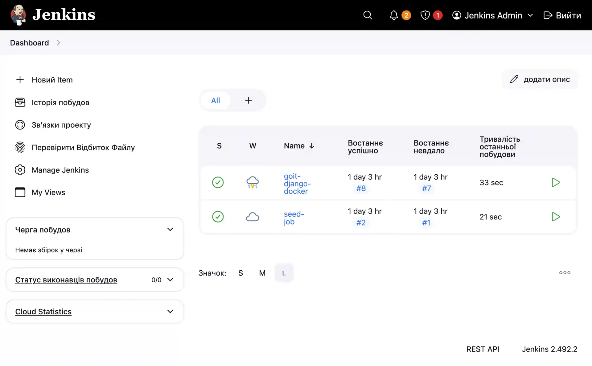
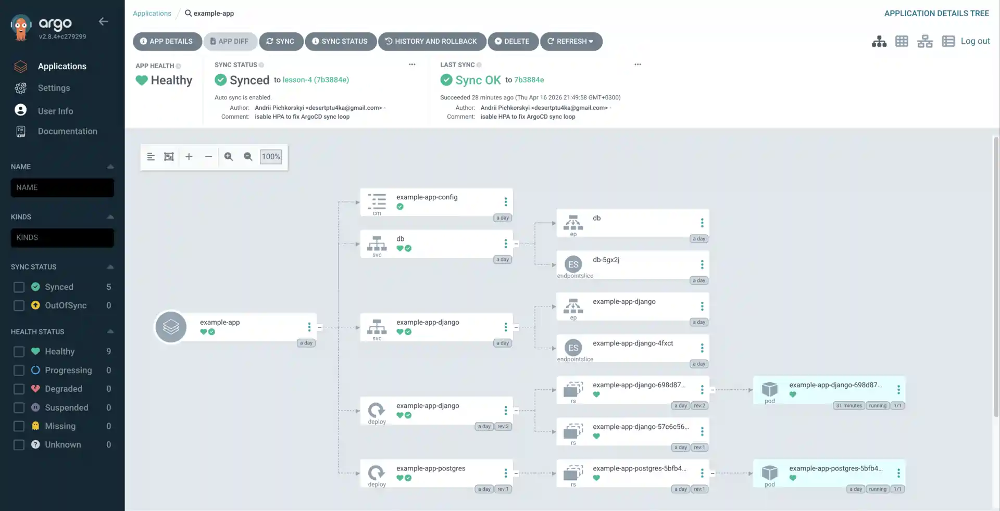
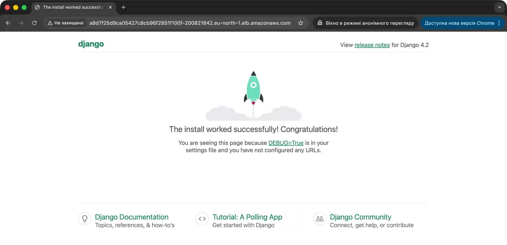
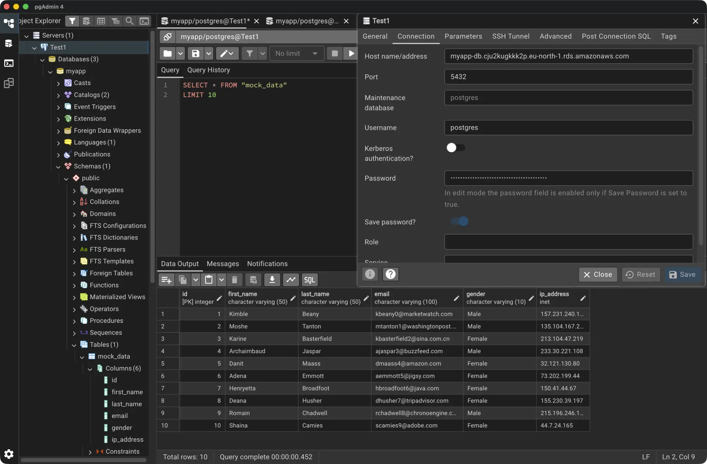
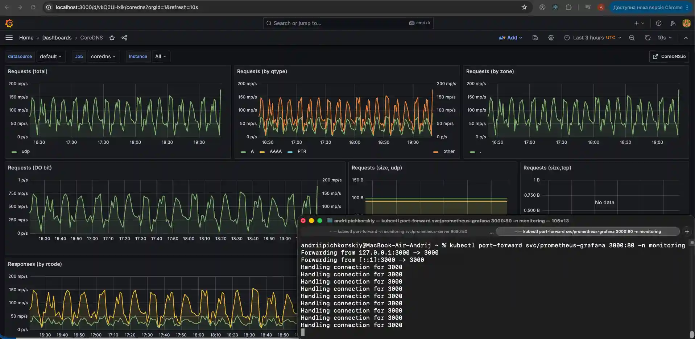
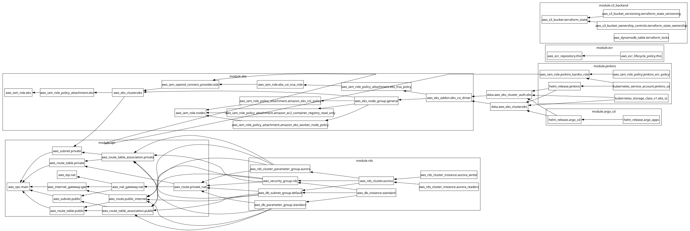

# CI/CD Infrastructure: Jenkins + Argo CD on AWS EKS

Цей проєкт автоматизує повний CI/CD процес для Django-застосунку з використанням **Jenkins** (CI), **Argo CD** (CD), **Helm** та **Terraform** на кластері **Amazon EKS**.

---

## Скріншоти

### Jenkins — Успішний CI Pipeline



### Argo CD — Синхронізований застосунок



### Django — Задеплоєний застосунок



### RDS PostgreSQL — Таблиця з даними (pgAdmin 4)



### Grafana — Моніторинг і Дашборди



### Граф Інфраструктури



---

## Схема CI/CD процесу

```
Зміна коду в GitHub
       │
       ▼
  Jenkins Pipeline
  ┌─────────────────────────────────┐
  │ 1. Kaniko: збирає Docker-образ  │
  │ 2. Пушить образ в AWS ECR       │
  │ 3. Оновлює tag у values.yaml    │
  │ 4. Пушить зміни в GitHub        │
  └─────────────────────────────────┘
       │
       ▼
  Git репозиторій (values.yaml оновлено)
       │
       ▼
  Argo CD (автоматично виявляє зміни)
       │
       ▼
  Kubernetes (EKS): деплоїть нову версію
```

---

## Структура проєкту

```
devops/
├── main.tf                  # Підключення всіх модулів
├── backend.tf               # Terraform backend (S3 + DynamoDB)
├── outputs.tf               # Виводи ресурсів
├── Jenkinsfile              # CI pipeline (збірка, пуш, оновлення тегу)
│
├── modules/
│   ├── s3-backend/          # S3 для стейту + DynamoDB для локінгу
│   ├── vpc/                 # VPC, публічні/приватні підмережі, NAT
│   ├── ecr/                 # ECR репозиторій для Docker-образів
│   ├── eks/                 # EKS кластер + node group + EBS CSI driver
│   ├── rds/                 # Універсальний модуль RDS (Aurora або Standard)
│   │   ├── rds.tf           # Standard aws_db_instance (use_aurora = false)
│   │   ├── aurora.tf        # Aurora Cluster + Writer + Reader replicas
│   │   ├── shared.tf        # DB Subnet Group + Security Group (спільне)
│   │   ├── variables.tf     # Всі змінні модуля
│   │   └── outputs.tf       # Виводи endpoint-ів
│   ├── jenkins/             # Jenkins (Helm) + IRSA для ECR + JCasC
│   └── argo_cd/             # Argo CD (Helm) + Application CRDs
│       └── charts/          # Helm-чарт для створення Argo CD Applications
│
├── charts/
│   └── django-app/          # Helm-чарт Django застосунку
│       ├── templates/
│       │   ├── deployment.yaml
│       │   ├── service.yaml
│       │   ├── configmap.yaml
│       │   ├── hpa.yaml
│       │   └── postgres.yaml  # PostgreSQL deployment + service
│       └── values.yaml
│
└── django/                  # Вихідний код Django + Dockerfile
```

---

## Передумови

- AWS CLI налаштований (`aws configure`)
- Встановлені: `terraform`, `kubectl`, `helm`
- GitHub токен (PAT) з правами `repo`

---

## Розгортання інфраструктури

### ⚠️ Перший запуск (bootstrapping) — обов'язково!

Існує класична проблема "курки та яйця": Terraform потребує S3-бакет для зберігання стейту, але сам S3-бакет створюється Terraform. Тому перший запуск відбувається у **3 етапи**:

**Етап 1: Закоментуй S3-бекенд**

Відкрий `backend.tf` і закоментуй весь блок:

```hcl
# terraform {
#   backend "s3" {
#     bucket         = "..."
#     ...
#   }
# }
```

**Етап 2: Створи тільки S3-бекенд і DynamoDB**

```bash
terraform init
terraform apply -target=module.s3_backend
```

_Це створить лише S3-бакет і DynamoDB-таблицю для зберігання стейту._

**Етап 3: Розкоментуй S3-бекенд і перенеси стейт у хмару**

Розкоментуй блок у `backend.tf`, потім:

```bash
terraform init
# Terraform запитає: "Do you want to migrate state?" → введи: yes
```

_Тепер стейт безпечно зберігається в AWS S3._

**Етап 4: Розгорни всю інфраструктуру**

```bash
terraform apply
```

_Terraform створить VPC, EKS, Jenkins, Argo CD і всі інші ресурси._

### 2. Підключення до кластера

```bash
aws eks update-kubeconfig --region eu-north-1 --name eks-cluster-demo-v2
```

### 3. Перевірка розгорнутих компонентів

```bash
# Всі поди системи
kubectl get pods -A

# Jenkins
kubectl get svc -n jenkins

# Argo CD
kubectl get svc -n argocd

# Django застосунок
kubectl get pods -n default
kubectl get svc -n default
```

---

## Налаштування секретів (перед першим apply)

Відкрий файл `modules/jenkins/values.yaml` і заміни:

```yaml
JCasC:
  configScripts:
    credentials: |
      credentials:
        system:
          domainCredentials:
            - credentials:
                - usernamePassword:
                    username: YOUR_GITHUB_USERNAME
                    password: "TODO: secret key here"  # ← вставити GitHub PAT
```

---

## Доступ до сервісів

### Jenkins

```bash
kubectl get svc -n jenkins
# Відкрий EXTERNAL-IP у браузері (порт 80)
# Login: admin / Password: admin123
```

### Argo CD

```bash
kubectl get svc -n argocd
# Відкрий EXTERNAL-IP у браузері

# Пароль адміністратора:
kubectl -n argocd get secret argocd-initial-admin-secret \
  -o jsonpath="{.data.password}" | base64 -d
```

### Django застосунок

```bash
kubectl get svc -n default
# Відкрий EXTERNAL-IP (порт 80) у браузері
```

### Grafana та Prometheus (Локальний доступ)

Моніторинг працює всередині кластера (ClusterIP). Щоб отримати до нього доступ з браузера, виконайте наступні команди (шлюз буде активним, поки термінал відкритий):

**Для Grafana:**
```bash
kubectl port-forward svc/prometheus-grafana 3000:80 -n monitoring
# Відкрий http://localhost:3000 (Логін: admin / Пароль: ваш grafana_password)
```

**Для Prometheus:**
```bash
kubectl port-forward svc/prometheus-kube-prometheus-prometheus 9090:9090 -n monitoring
# Відкрий http://localhost:9090
```

---

## Як запустити CI/CD пайплайн

1. Зайди в Jenkins UI
2. Запусти джобу **`seed-job`** → вона створить **`goit-django-docker`**
3. Затвердь скрипт: **Manage Jenkins → In-process Script Approval → Approve**
4. Запусти **`goit-django-docker`** → Jenkins збере образ, запушить в ECR і оновить тег
5. Argo CD автоматично виявить зміну і задеплоїть нову версію в Kubernetes

---

## Знищення інфраструктури

> ⚠️ **EKS Control Plane коштує ~$0.10/год.** Завжди видаляй ресурси після роботи!

```bash
terraform destroy
```

---

## Технічний стек

| Компонент             | Технологія                        |
| --------------------- | --------------------------------- |
| Інфраструктура як код | Terraform                         |
| Хмарний провайдер     | AWS (EKS, ECR, VPC, S3, DynamoDB) |
| Kubernetes            | Amazon EKS (`t3.small` nodes)     |
| CI (збірка образів)   | Jenkins + Kaniko                  |
| CD (деплой)           | Argo CD                           |
| Пакетний менеджер     | Helm                              |
| Застосунок            | Django + PostgreSQL               |
| Реєстр образів        | Amazon ECR                        |
| База даних            | Amazon RDS (PostgreSQL / Aurora)  |

---

## Модуль RDS

Модуль `modules/rds` — **універсальний**: залежно від змінної `use_aurora` він підіймає або стандартну RDS-інстанцію, або повноцінний Aurora-кластер із writer та reader репліками.

### Логіка перемикання

| `use_aurora` | Що створюється |
|---|---|
| `false` (за замовч.) | `aws_db_instance` (стандартна RDS) |
| `true` | `aws_rds_cluster` + `aws_rds_cluster_instance` (writer + readers) |

В **обох** випадках автоматично створюються:
- `aws_db_subnet_group` — підмережева група
- `aws_security_group` — група безпеки (ingress 5432)
- `aws_db_parameter_group` або `aws_rds_cluster_parameter_group` — parameter group

---

### Приклад використання модуля

#### Aurora PostgreSQL (рекомендовано для production)

```hcl
module "rds" {
  source = "./modules/rds"

  name       = "myapp-db"
  use_aurora = true

  # Aurora
  engine_cluster                = "aurora-postgresql"
  engine_version_cluster        = "15.3"
  parameter_group_family_aurora = "aurora-postgresql15"
  aurora_replica_count          = 1   # кількість reader-нод

  # Спільне
  instance_class          = "db.t3.medium"
  db_name                 = "myapp"
  username                = "postgres"
  password                = var.db_password  # чутливі дані — через змінну!
  vpc_id                  = module.vpc.vpc_id
  subnet_private_ids      = module.vpc.private_subnets
  subnet_public_ids       = module.vpc.public_subnets
  publicly_accessible     = false
  backup_retention_period = 7

  parameters = {
    max_connections            = "200"
    log_min_duration_statement = "500"
  }

  tags = {
    Environment = "production"
    Project     = "myapp"
  }
}
```

#### Стандартна RDS PostgreSQL (dev / staging)

```hcl
module "rds" {
  source = "./modules/rds"

  name       = "myapp-db-dev"
  use_aurora = false  # ← стандартна RDS

  engine                     = "postgres"
  engine_version             = "14.7"
  parameter_group_family_rds = "postgres14"

  instance_class          = "db.t3.micro"
  allocated_storage       = 20
  db_name                 = "myapp"
  username                = "postgres"
  password                = var.db_password
  vpc_id                  = module.vpc.vpc_id
  subnet_private_ids      = module.vpc.private_subnets
  subnet_public_ids       = module.vpc.public_subnets
  multi_az                = false
  backup_retention_period = 1

  tags = {
    Environment = "dev"
  }
}
```

---

### Опис змінних

| Змінна | Тип | Default | Опис |
|---|---|---|---|
| `name` | `string` | — | Унікальне ім'я інстансу/кластера (ідентифікатор ресурсів) |
| `use_aurora` | `bool` | `false` | `true` → Aurora кластер, `false` → стандартна RDS |
| `engine` | `string` | `"postgres"` | Engine для стандартної RDS (`postgres`, `mysql`) |
| `engine_version` | `string` | `"14.7"` | Версія engine для стандартної RDS |
| `parameter_group_family_rds` | `string` | `"postgres15"` | Family для parameter group стандартної RDS |
| `engine_cluster` | `string` | `"aurora-postgresql"` | Engine для Aurora кластера |
| `engine_version_cluster` | `string` | `"15.3"` | Версія engine для Aurora |
| `parameter_group_family_aurora` | `string` | `"aurora-postgresql15"` | Family для parameter group Aurora |
| `aurora_replica_count` | `number` | `1` | Кількість reader-реплік в Aurora |
| `instance_class` | `string` | `"db.t3.micro"` | Клас інстансу (`db.t3.micro`, `db.t3.medium`, …) |
| `allocated_storage` | `number` | `20` | Розмір диску в GB (лише для стандартної RDS) |
| `db_name` | `string` | — | Ім'я БД, яка буде створена |
| `username` | `string` | — | Ім'я master-користувача |
| `password` | `string` | — | Пароль master-користувача (**sensitive**) |
| `vpc_id` | `string` | — | ID VPC |
| `subnet_private_ids` | `list(string)` | — | ID приватних підмереж |
| `subnet_public_ids` | `list(string)` | — | ID публічних підмереж |
| `publicly_accessible` | `bool` | `false` | Чи доступна БД з інтернету |
| `multi_az` | `bool` | `false` | Multi-AZ для стандартної RDS |
| `backup_retention_period` | `string` | `""` | Кількість днів зберігання бекапів |
| `parameters` | `map(string)` | `{}` | Параметри для parameter group |
| `tags` | `map(string)` | `{}` | Теги для всіх ресурсів модуля |

---

### Як змінити тип БД, engine або клас інстансу

**Перемкнути з Aurora на стандартну RDS:**
```hcl
use_aurora = false
engine     = "postgres"   # або "mysql"
engine_version             = "14.7"
parameter_group_family_rds = "postgres14"
```

**Перейти на MySQL:**
```hcl
use_aurora                 = false
engine                     = "mysql"
engine_version             = "8.0"
parameter_group_family_rds = "mysql8.0"
```

**Збільшити клас інстансу:**
```hcl
instance_class = "db.r6g.large"   # для production Aurora
```

**Додати параметри БД:**
```hcl
parameters = {
  max_connections            = "500"
  log_min_duration_statement = "1000"
  work_mem                   = "65536"
}
```
