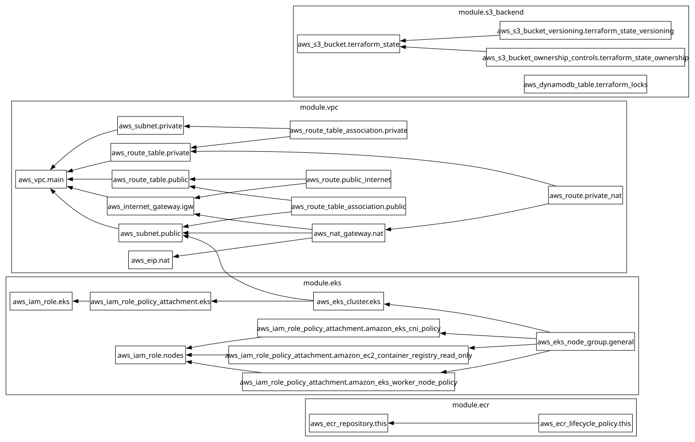

# Домашнє завдання до теми «IaC (Terraform)»

Цей проєкт призначений для створення базової інфраструктури в AWS за допомогою Terraform. Він містить налаштування для зберігання стану Terraform (S3 та DynamoDB), мережевої інфраструктури (VPC) та репозиторію для зберігання Docker-образів (ECR).

## Граф Інфраструктури


## Структура проєкту

- **main.tf** — головний файл, у якому підключаються та налаштовуються всі модулі.
- **backend.tf** — конфігурація бекенду для зберігання файлів стану Terraform у S3 з використанням DynamoDB для блокування.
- **outputs.tf** — файл для виведення загальних даних про створені ресурси.
- **variables.tf** — файл для збереження глобальних змінних.
- **modules/** — директорія, де знаходяться всі модулі:
  - **s3-backend/** — модуль для створення S3-бакета з версіонуванням та таблиці DynamoDB для блокування.
  - **vpc/** — модуль для розгортання мережевої інфраструктури (VPC, публічні та приватні підмережі, Internet Gateway).
  - **ecr/** — модуль для створення Amazon Elastic Container Registry (ECR) для зберігання Docker-образів та налаштування політик життєвого циклу.

## Опис модулів

### Module: `s3-backend`
Створює S3-бакет для зберігання `terraform.tfstate`. Бакет має ввімкнене версіонування для безпеки та можливості відновлення попередніх станів. Також створюється таблиця DynamoDB, яка використовується для блокування стану (Locking), щоб уникнути конфліктів при одночасній роботі кількох процесів.

### Module: `vpc`
Організовує мережеву інфраструктуру:
- Створює VPC із визначеним CIDR-блоком.
- Створює три публічні та три приватні підмережі в різних зонах доступності.
- Налаштовує Internet Gateway для доступу в інтернет з публічних підмереж.

### Module: `ecr`
Створює приватний репозиторій Amazon ECR для зберігання образів контейнерів в AWS. Увімкнене автоматичне сканування образів на вразливості (`scan_on_push = true`) та налаштована політика життєвого циклу (Lifecycle Policy), яка автоматично видаляє старі образи (залишає лише 10 останніх).

## Команди для ініціалізації та запуску (Bootstrapping)

Оскільки цей проєкт створює S3-бакет і DynamoDB-таблицю для зберігання власного стану (стейту), виникає класична проблема "курки та яйця" (Terraform потребує S3 для старту, але S3 створюється самим Terraform). Для першого розгортання "з нуля" використовується двоетапна ініціалізація:

1. **Тимчасово вимкніть S3-бекенд**
   Закоментуйте вміст файлу `backend.tf` (або перейменуйте його на `backend.tf.bak`), щоб Terraform використовував локальний стейт.

2. **Перша ініціалізація та створення бекенду**
   Виконайте ці команди для створення S3 та DynamoDB в AWS:
   ```bash
   terraform init
   terraform apply -target=module.s3_backend
   ```
   *(Підтвердьте створення, ввівши `yes`)*

3. **Міграція стейту в S3**
   Розкоментуйте або поверніть файл `backend.tf`. Потім виконайте міграцію локального стейту у створений AWS S3 бакет:
   ```bash
   terraform init
   ```
   *(Підтвердьте міграцію стейту, ввівши `yes`)*

4. **Розгортання всієї інфраструктури**
   Тепер стейт безпечно зберігається в хмарі. Можна розгорнути всі інші ресурси (VPC, NAT, ECR):
   ```bash
   terraform apply
   ```

### Звичайне використання
Коли інфраструктуру вже ініціалізовано:
- `terraform plan` — перегляд плану змін.
- `terraform apply` — застосування нових змін в AWS.
- `terraform destroy` — видалення всіх створених ресурсів. *(Примітка: через спільне керування бекендом, під час повного знищення може знадобитись ручне очищення/видалення S3-бакета після того, як DynamoDB таблиця буде знищена).*
